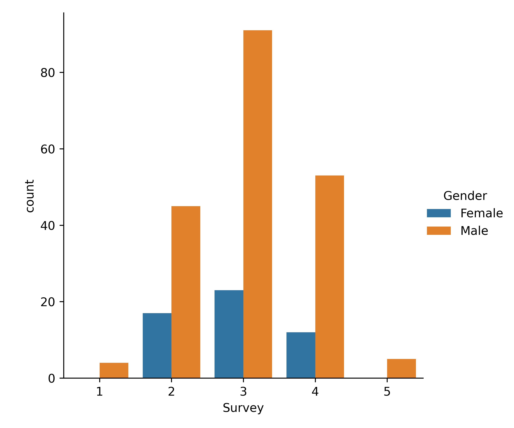
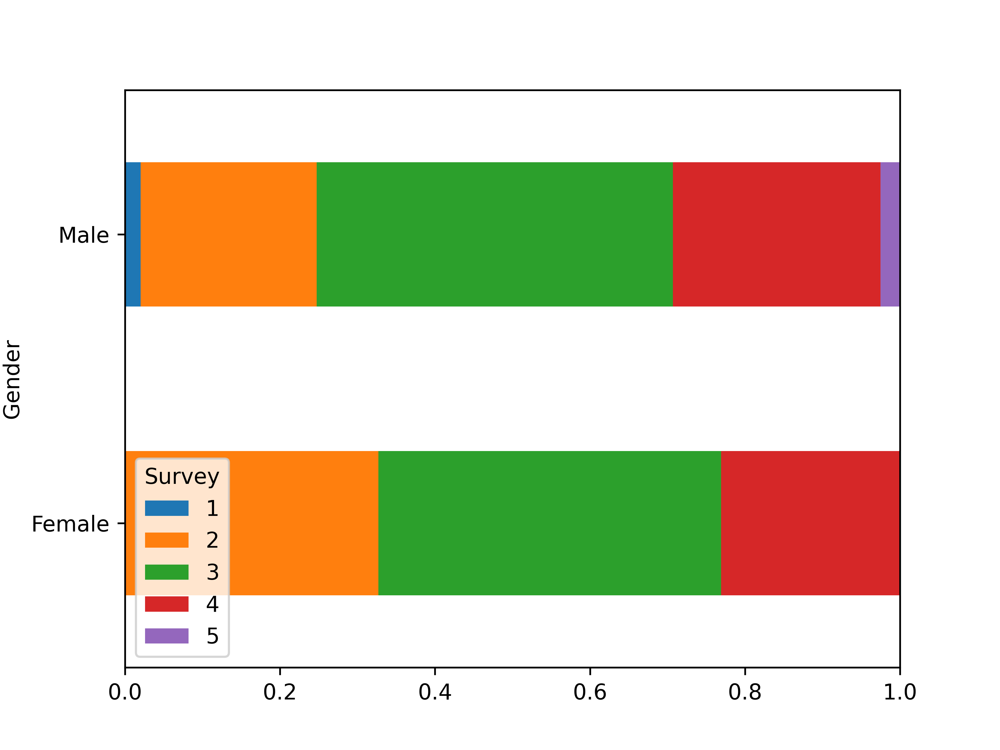
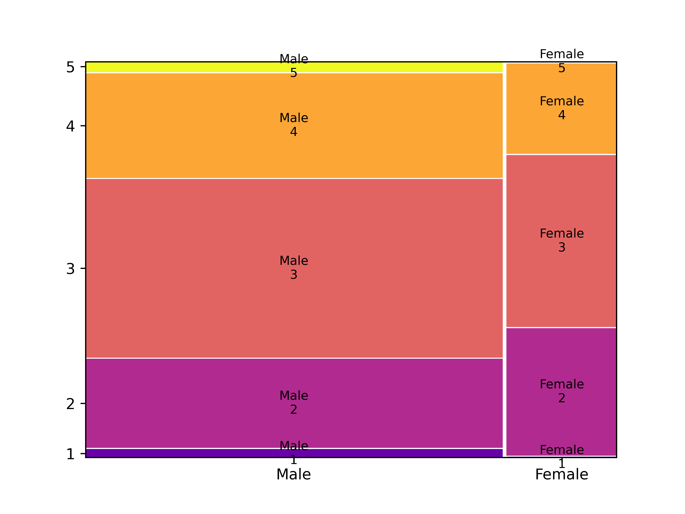
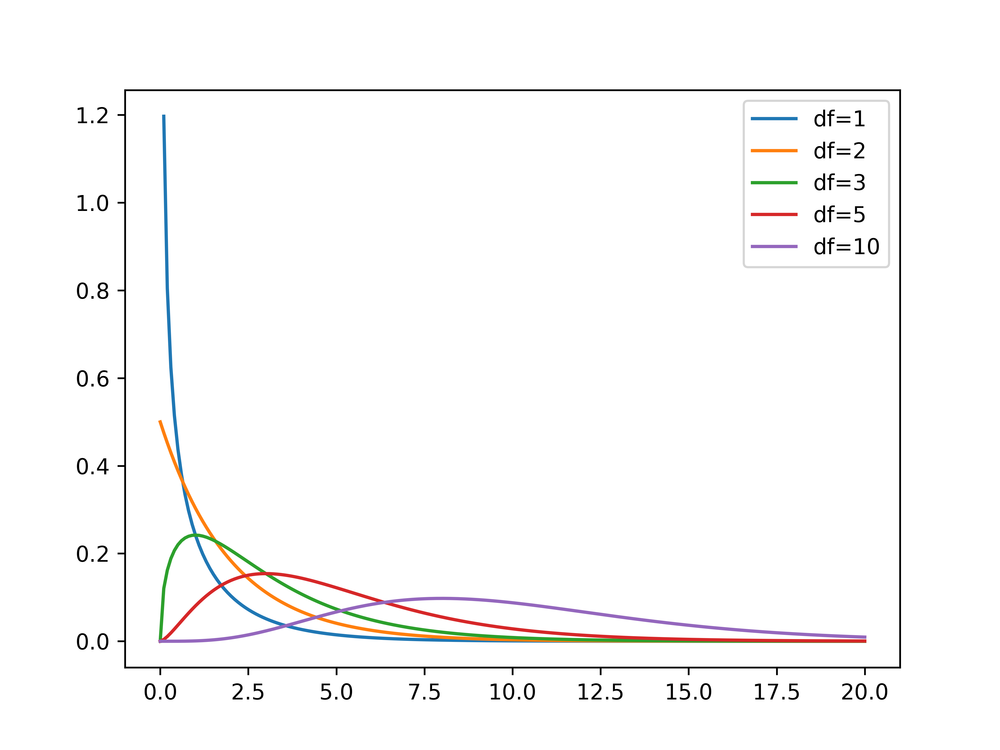
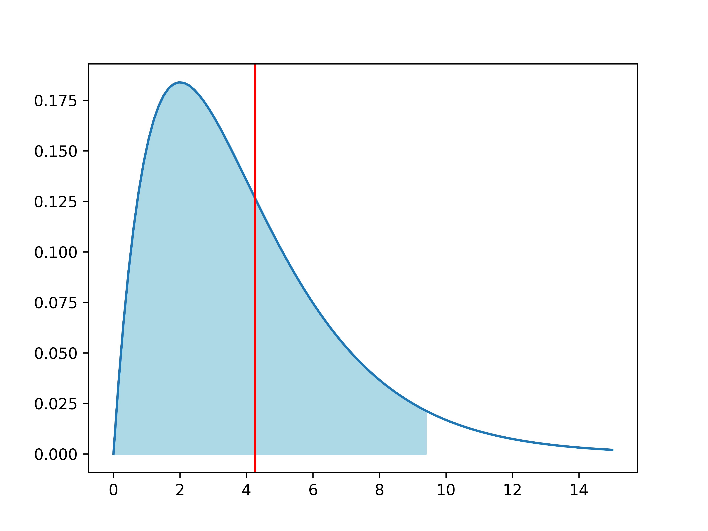

# Chapter 4: Bivariate analysis of qualitative variables"

---

## Learning goals

- Dependent/independent variable

- Apply suitable analysis techniques for each combination of measurement
  levels

- Contingency tables and Cramér's $V$

- Visualization

-v-

## Overview: bivariate analysis techniques

| **Independent** | **Dependent** |  **Test/Metric**                |
| :---:           | :---:         | :---                            |
| Qualitative     | Qualitative   | $\chi^2$-test/Cramér's $V$      |
| Qualitative     | Quantitative  | two-sample $t$-test/Cohen's $d$ |
| Quantitative    | Quantitative  | -/Regression, correlation       |

-v-

## Overview: bivariate analysis - visualization

| **Independent** | **Dependent** |  **Plot**                                  |
| :---:           | :---:         | :---                                       |
| Qualitative     | Qualitative   | Grouped/stacked bar chart, mosaic plot     |
| Qualitative     | Quantitative  | Grouped boxplot, bar chart with error bars |
| Quantitative    | Quantitative  | Scatter plot, regression line              |

-v-

## Bivariate analysis

- ...is determining whether there is an association between two
  stochastic variables ($X$ and $Y$).

- **Association** = you can predict (to some extent) the value of $Y$
  from the value of $X$

    - $X$: Independent variable

    - $Y$: Dependent variable

- **Important!** Finding an association does **NOT** imply a causal relation!

-v-

## Example research questions

- Is there a difference in taste preference between two beverage brands?

- Is there a difference in spending at the campus restaurant between
  students and staff?

- Do smokers die more often of lung cancer than non-smokers?

- Do men and women have a different opinion on a survey question?

- ...

We will use [data/rlanders.csv](https://github.com/HoGentTIN/dsai-labs/blob/main/data/rlanders.csv) from the Github repo for lab assignments
to explore the last question.

---

# Contingency tables

-v-

## Contingency tables (cross-tabs)

See Python example code in [4.01-chi-squared.ipynb](https://github.com/HoGentTIN/dsai-labs/blob/main/4-bivariate-qual/4.01-chi-squared.ipynb)

|                    | **Female** | **Male** |
|------------------: | ---------: | -------: |
|  Strongly disagree |          0 |        4 |
|           Disagree |         17 |       45 |
|            Neutral |         23 |       91 |
|              Agree |         12 |       53 |
|     Strongly agree |          0 |        5 |

---

# Visualization

-v-

## Clustered bar plot



-v-

## Stacked bar plot



-v-

## Mosaic plot



---

# Finding associations in contingency tables

-v-

## Contingency table with marginal totals

| Survey   |   Female |   Male |   All |
|:---------|---------:|-------:|------:|
| 1        |        0 |      4 |     4 |
| 2        |       17 |     45 |    62 |
| 3        |       23 |     91 |   114 |
| 4        |       12 |     53 |    65 |
| 5        |        0 |      5 |     5 |
| All      |       52 |    198 |   250 |

-v-

## Expected values

If there is no difference (association), we expect the same ratios in
each column of the table!

| Survey |    Female |       Male |     All |
|-------:|----------:|-----------:|--------:|
|      1 | 0.832     | 3.168      |   **4** |
|      2 | 12.896    | 49.104     |  **62** |
|      3 | 23.712    | 90.288     | **114** |
|      4 | 13.52     | 51.48      |  **65** |
|      5 | 1.04      | 3.96       |   **5** |
|    All | **52**    |    **198** | **250** |

In each cell: (row total $\times$ column total) / $n$

-v-

## Measuring dispersion

How far is the observed value $o$ from the expected $e$?

$$\frac{{(o - e)}^2}{e}$$

|   Survey |    Female |       Male |
|---------:|----------:|-----------:|
|        1 | 0.832     | 0.218505   |
|        2 | 1.30605   | 0.343003   |
|        3 | 0.0213792 | 0.00561474 |
|        4 | 0.170888  | 0.0448796  |
|        5 | 1.04      | 0.273131   |

-v-

## The $\chi^2$-statistic

The sum of all these values is notated:

$$\chi^2 = \sum_i \frac{{(o_i - e_i)}^2}{e_i} \approx 4.255$$

- $\chi$ is the Greek letter *chi*
- $o_i$ = number of observations in the $i$'th cell of the contingency
  table
- $e_i$ = expected frequency

Interpretation:

- Small value $\Rightarrow$ no association
- Large value $\Rightarrow$ association

-v-

## Cramér's $V$

When is $\chi^2$ large enough?

- $2\times2$-table with $\chi^2 = 10$

  - Relatively large difference

  - Indicates association

- $5\times5$-table with $\chi^2 = 10$

  - Relatively small difference

  - Does NOT indicate association

We need a metric independent of table size!

-v-

## Cramér's V

$$V = \sqrt{\frac{\chi^2}{n(k-1)}} = \sqrt{\frac{4.255}{250(2-1)}} \approx 0.130$$

with $n$ the number of observations, $k = \min(numRows, numCols)$

Interpretation:

| Cramér's V | Interpretation          |
| :---:      | :---                    |
| 0          | No association          |
| 0.1        | Weak association        |
| 0.25       | Moderate association    |
| 0.50       | Strong association      |
| 0.75       | Very strong association |
| 1          | Complete association    |

---

# Chi-squared test for independence

-v-

## $\chi^2$ test for independence

- = Alternative to Cramér's V to investigate association between
  qualitative variables.

- Value of $\chi^2$ distributed according to the $\chi^2$ distribution

-v-

## The $\chi^2$ distribution



-v-

## $\chi^2$-distribution in Python

Import `scipy.stats`

For a $\chi^2$-distribution with `df` degrees of freedom:

| Function | Description |
| :---:    | :---        |
| `stats.chi2.pdf(x, df)` | Probability density function |
| `stats.chi2.cdf(x, df)` | Left-tail probability $P(X < x)$ |
| `stats.chi2.sf(x, df)`  | Right-tail probability $P(X > x)$ |
| `stats.chi2.isf(q, df)` | $q$ percent of observations exceed this value |

-v-

## Test procedure

- **Step 1.** Formulate hypotheses:

    - $H_0$: there is no association ($\chi^2$ is "small")

    - $H_1$: there is an association ($\chi^2$ is "large")

- **Step 2.** Choose significance level, e.g. $\alpha = 0.05$

- **Step 3.** Calculate the test statistic, $\chi^2 = 4.255$

-v-

## Test procedure (cont.)

- **Step 4.** Use $df = (numRow-1)\times(numCol-1)$ and either:

    - Determine critical value $g$ so $P(\chi^2>g)=\alpha$

    - Calculate the $p$-value

- **Step 5.** Draw conclusion:

    - $\chi^2 < g$: do not reject $H_0$; $\chi^2 > g$: reject $H_0$

    - $p > \alpha$: do not reject $H_0$; $p < \alpha$: reject $H_0$

-v-

## Example (Gender vs Survey)

- `g = stats.chi2.isf(0.05, df=4)` (result: 9.4877)

- `p = stats.chi2.sf(4.2555, df=4)` (result: 0.3725)



-v-

## Conclusion

We do not reject the null hypothesis. Differences
between expected and observed values are not significantly large.

We found no association between variables *Gender* and *Survey*

-v-

## Test for independence in Python

SciPy has a function to calculate $\chi^2$ and $p$-value from a
contingency table:

``` python
observed = pd.crosstab(rlanders.Survey, rlanders.Gender)
chi2, p, df, expected = stats.chi2_contingency(observed)

print("Chi-squared       : %.4f" % chi2)
print("Degrees of freedom: %d" % df)
print("P-value           : %.4f" % p)
```

---

# The Goodness-of-fit test

-v-

## The Goodness-of-fit test

(TODO)

---

# Standardized residuals

-v-

## Standardized residuals

(TODO)

---

# Cochran's rule of thumb

-v-

## Cochran's rule of thumb

In order to apply the $\chi^2$-test, the following conditions must be
met:

1. For all categories, the expected frequency $e$ must be greater than 1.

2. In a maximum of 20 % of the categories, the expected frequency $e$ may be less than 5.
