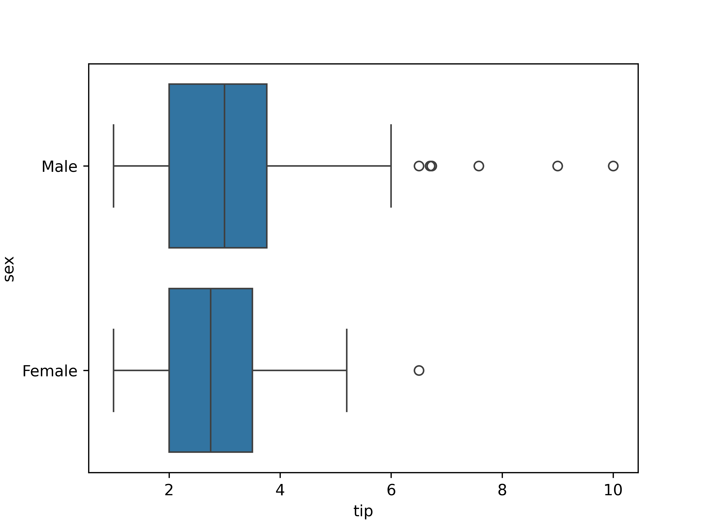
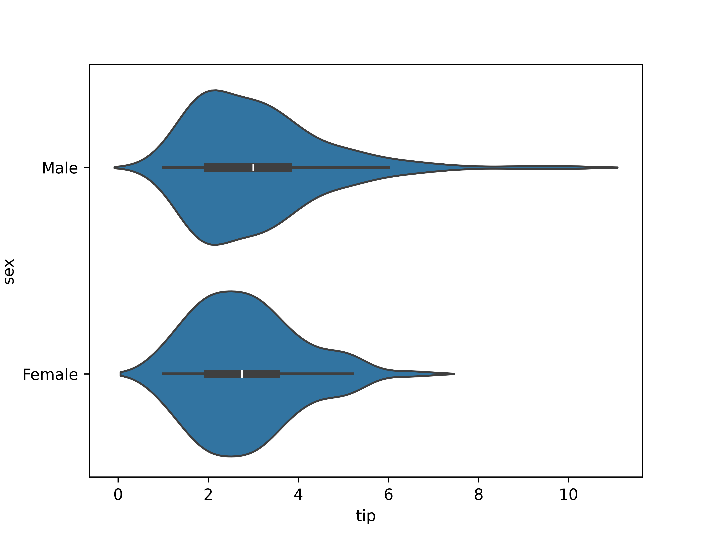
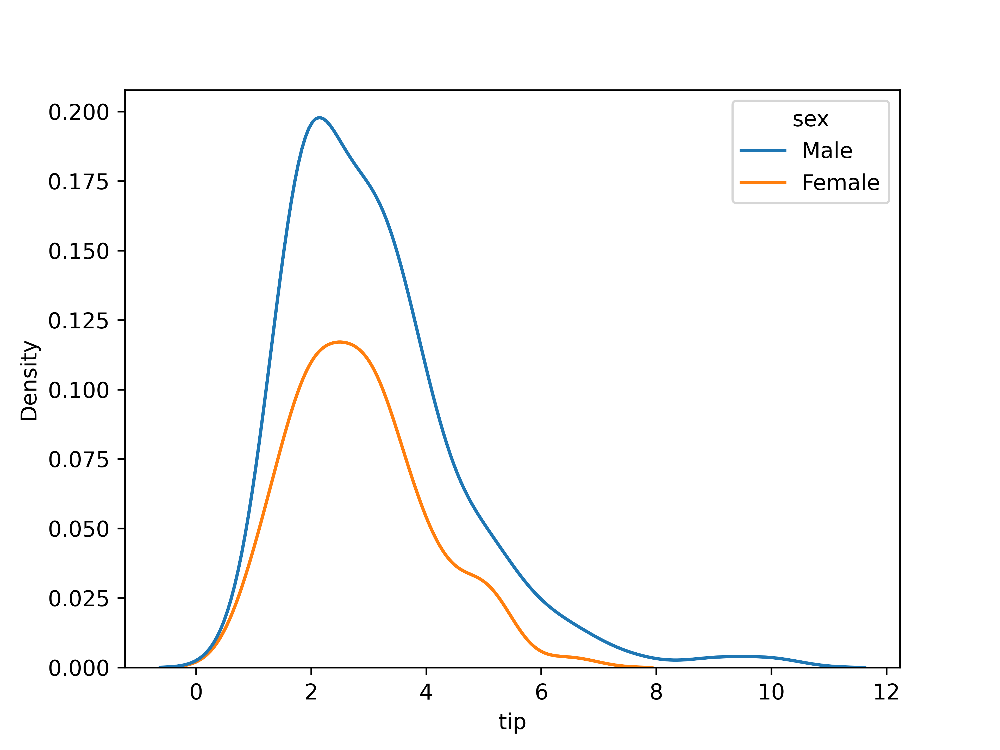
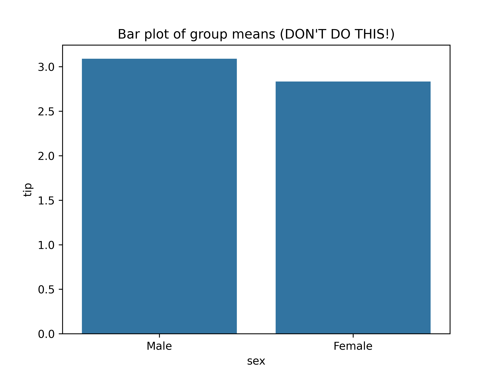
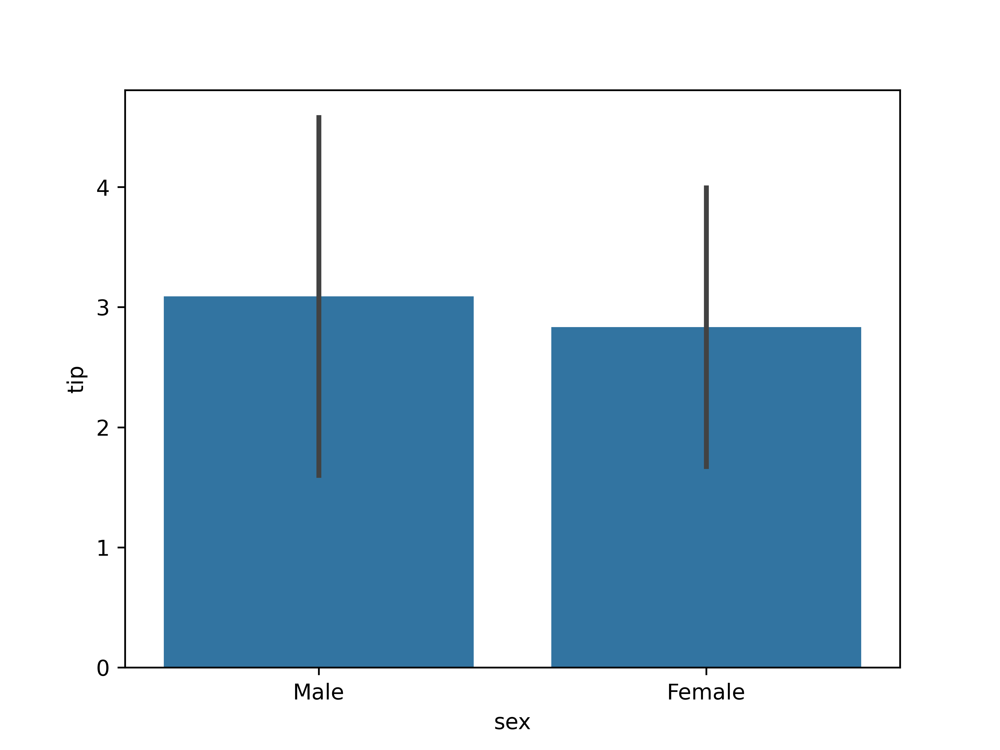

# Chapter 5: Bivariate analysis of qualitative and quantitative variables

---

## Learning goals

- Apply the $t$-test for two samples
- Calculate effect size using Cohen's $d$
- Visualization

-v-

## Overview: bivariate analysis techniques

| **Independent** | **Dependent** |  **Test/Metric**                |
| :---:           | :---:         | :---                            |
| Qualitative     | Qualitative   | $\chi^2$-test/Cramér's $V$      |
| Qualitative     | Quantitative  | two-sample $t$-test/Cohen's $d$ |
| Quantitative    | Quantitative  | -/Regression, correlation       |

-v-

## Overview: bivariate analysis - visualization

| **Independent** | **Dependent** |  **Plot**                                  |
| :---:           | :---:         | :---                                       |
| Qualitative     | Qualitative   | Grouped/stacked bar chart, mosaic plot     |
| Qualitative     | Quantitative  | Grouped boxplot, bar chart with error bars |
| Quantitative    | Quantitative  | Scatter plot, regression line              |

-v-

## Example research questions

- Are male penguins larger than females?

- Do men get a higher salary than women?

- Does a new vaccine protect against a disease?

- Does "retrieval practice" improve learning outcomes (i.e. student
  grades)?

- ...

In these examples, what is the independent/dependent variable?

---

# Data visualization

-v-

## Plot types

- Chart types for quantitative data

- Grouped by qualitative variable

Suitable chart types:

- Grouped boxplot

- Grouped density plot

- Bar chart with error bars

-v-

## Grouped boxplot



-v-

## Grouped violin plot



-v-

## Grouped density plot



-v-

## Beware! Bar chart of group means



-v-

## Bar chart with error bars



-v-

## Bar chart with error bars

- Always add error bars!

- Only makes sense for normally distributed data

- Example: 1 standard deviation:

---

# Two-sample $t$-test

-v-

## Comparing two population means

Are the population means of two populations different?

We use two *samples* to perform an appropriate statistical test.

Correct test depends on:

- Independent samples

- Paired samples

---

# Independent samples

-v-

## Example: independent samples

In a clinical study, the aim is to determine whether a new drug has a
delayed (i.e. higher) reaction time as a side effect.

- Control group: 6 participants receive placebo
- Intervention group: 6 participants receive medicine

Next, the reaction time (in ms) is measured:

- Control group: 91, 87, 99, 77, 88, 91 ($\overline{x}=88.83$)
- Intervention group: 101, 110, 103, 93, 99, 104 ($\overline{y}=101.67$)

Are there significant differences between the intervention and control
group?

-v-

## Testing procedure

1. Hypotheses:

    - $H_0$: $\mu_1 - \mu_2 = 0$

    - $H_1$: $\mu_1 - \mu_2 < 0$

2. Significance level: $\alpha = 0.05$

-v-

## Testing procedure (cont.)

3. Test statistic is based on:

    - $\overline{x}-\overline{y} = -12.833$
    - $\overline{x} =$ estimation for $\mu_1$ (control group)
    - $\overline{y} =$ estimation for $\mu_2$ (intervention group)
    - Takes the variances of the samples into account. For completeness, the test statistic is

      $$t = \frac{\overline{x} - \overline{y}}{\sqrt{s_x^2/n_x + s_y^2/n_y}}.$$

-v-

## Testing procedure (cont.)

4. Calculate $p$-value

    ```python
    control = np.array([91, 87, 99, 77, 88, 91])
    treatment = np.array([101, 110, 103, 93, 99, 104])
    stats.ttest_ind(a=control, b=treatment,
                    alternative='less', equal_var=False)
    ```

    Result:

    ```console
    Ttest_indResult(statistic=-3.445612673536487, 
          pvalue=0.003391230079206901)
    ```

-v-

## Testing procedure (cont.)

5. Draw conclusion based on $p$-value.

    $p \approx 0.00339 < \alpha = 0.05$.

    We reject the null hypothesis.
    In this sample, there is reason to assume that the drug does indeed
    increase reaction time.

---

# Paired samples

-v-

## Example: paired samples

A study examined whether cars that run on petrol with additives have a
lower consumption, i.e. a higher miles per gallon.

For 10 cars, the consumption was measured (expressed in miles per
gallon) for both fuel types:

|            **Car** |  1 |  2 |  3 |  4 |  5 |  6 |  7 |  8 |  9 | 10 |
|--------------------|----|----|----|----|----|----|----|----|----|----|
| **Regular petrol** | 16 | 20 | 21 | 22 | 23 | 22 | 27 | 25 | 27 | 28 |
| **With additives** | 19 | 22 | 24 | 24 | 25 | 25 | 25 | 26 | 28 | 32 |

-v-

## Testing procedure

1. Hypotheses:

    - $H_0$: $\mu_{X-Y} = 0$
    - $H_1$: $\mu_{X-Y} < 0$

2. Significance level: $\alpha = 0.05$

-v-

## Testing procedure (cont.)

3. Test statistic is based on mean of the differences:

    $\overline{d} = \overline{x-y}$

    For completeness, the test statistic is

    $$t = \frac{\overline{d}}{s_d / \sqrt{n}}$$

-v-

## Testing procedure (cont.)

4. Calculate $p$-value in Python:

    ```python
    regular = np.array([16, 20, 21, 22, 23, 22, 27, 25, 27, 28])
    additives = np.array([19, 22, 24, 24, 25, 25, 25, 26, 28, 32])
    stats.ttest_rel(a=regular, b=additives, alternative='less')
    ```

    Result:

    ```console
    Ttest_relResult(statistic=-3.1622776601683794,
                    pvalue=0.006708203932499369)
    ```

-v-

## Testing procedure (cont.)

5. Draw conclusion based on $p$-value.

    $p \approx 0.0007749 < \alpha = 0.05$.
    
    We reject the null hypothesis. In this sample, there is reason to assume that the fuel with additives leads to lower fuel consumption, i.e. higher miles per gallon.

---

# Effect size

-v-

## Effect size

Effect size The **effect size** is a metric which expresses how great the difference between two groups is

- Control group vs. intervention group

- Can be used in addition to hypothesis test

- Often used in educational sciences

- There are several definitions, here: *Cohen's $d$*

-v-

## Cohen's $d$

$$d = \frac{\overline{x_1} - \overline{x_2}}{s}$$

where $\overline{x_1}$ and $\overline{x_2}$ represent the sample means

and $s$ the pooled standard deviation, i.e. standard deviation of both
groups combined:

$$s = \sqrt{\frac{(n_1 - 1) s_1^2 + (n_2 - 1) s_2^2}{n_1 + n_2 -2}}$$

with $n_1$, $n_2$ the sample sizes, and $s_1$, $s_2$ the standard
deviations of each group.

-v-

## Interpretation Cohen's $d$

| $d$  | Interpretation    |
|------|-------------------|
| 0.01 | very small effect |
| 0.2  | small effect      |
| 0.5  | medium effect     |
| 0.8  | large effect      |
| 1.2  | very large effect |
| 2.0  | huge effect       |
